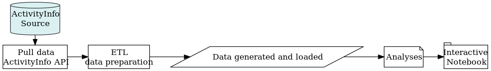

<!-- README.md is generated from README.Rmd. Please edit that file -->

# QualMiner

Exploring qualitative indicators via text mining methods.

This repository contains the analysis code. The data used here can only
be accessed by using *ActivityInfo*.

### Main steps

In order to reproduce the code, follow the steps below:

#### 0\. Authenticate

The call below authenticates the current user for the requests to get
the data from *ActivityInfo*. See [**Notes**](#notes) section for more
details.

``` r
activityinfo::activityInfoLogin()
```

#### 1\. Retrieve data & ETL

Source `etl.R` file in the `R/` directory to pull the data from
*ActivityInfo API* and process it to make it ready for analyses. At the
end, a JSON file will be saved in the `data/` directory.

#### 2\. Analysis

Render RMarkdown files placed in the `/analysis` directory. For
instance;

``` r
path <- file.path("analysis", "april2019-response-quality.Rmd")
rmarkdown::render(path)
```

Rendering does not require any connection with the *ActivityInfo API*
but the JSON data file must exist in the `data/` directory.

### Process diagram

<!-- DIAGRAM START -->

 <!-- DIAGRAM END -->

### Notes

  - The data can be accessed with *ActivityInfo* API by using user
    credentials. The [**ActivityInfo R Language
    Client**](https://github.com/bedatadriven/activityinfo-R) provides a
    good documentation.

  - [**dplyr**](https://cran.r-project.org/package=dplyr) package is
    chosen as it is useful for rapid ad-hoc analyses. The selected
    analysis code can be rewritten in base R, which is proven to be more
    robust and stable for production environments, towards the end of
    the project.
