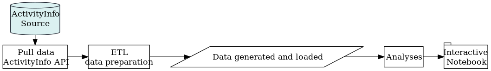

<!-- README.md is generated from README.Rmd. Please edit that file -->

# QualMiner

Exploring qualitative indicators via text mining methods.

### Main steps

### Notes

  - The data can be accessed with *ActivityInfo* API by using user
    credentials. See [**ActivityInfo R Language
    Client**](https://github.com/bedatadriven/activityinfo-R) for more
    details.

  - [dplyr](https://cran.r-project.org/package=dplyr) package is chosen
    as it is useful for rapid ad-hoc analyses. The selected analysis
    code can be rewritten in base R, which is proven to be more robust
    and stable for production environments, towards the end of the
    project.
